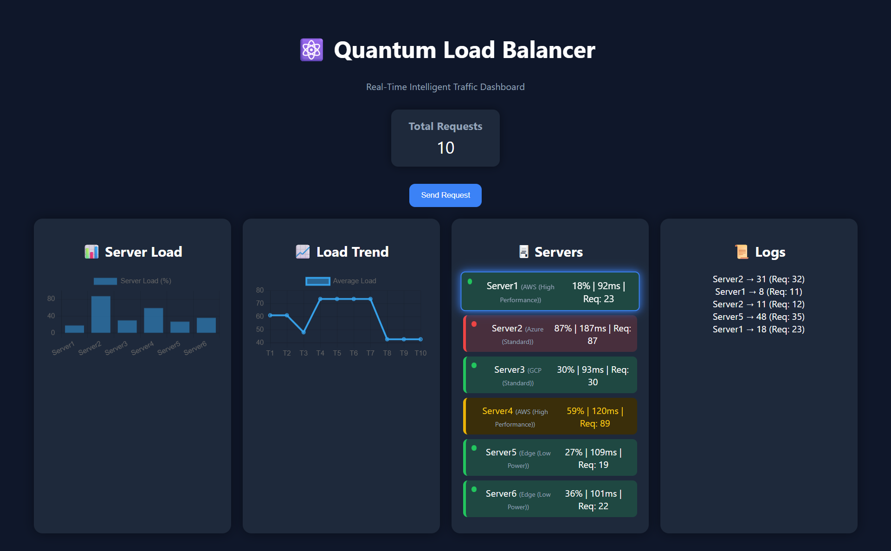

# ⚡ Quantum Load Balancer

An intelligent Python Flask-based load balancer that distributes incoming requests across multiple servers using a weighted scoring algorithm. The system continuously monitors server health, detects overloaded servers, and automatically redirects traffic to maintain high availability.

---

## 🌐 Live Demo

https://quantum-load-balancer.onrender.com/dashboard
---

## 📸 Dashboard Preview



---

## 💡 Why "Quantum"?

The project is inspired by quantum optimization concepts, where multiple possibilities are evaluated to determine the most efficient outcome.

Although this is **not a quantum computing implementation**, it simulates intelligent server selection using a weighted scoring algorithm that evaluates server load, response time, health status, and availability to make optimized routing decisions.

---

# 🚀 Features

- Intelligent request distribution
- Weighted server selection algorithm
- Automatic failover mechanism
- Real-time server health monitoring
- Dynamic load balancing
- Live monitoring dashboard
- REST API endpoints
- Interactive charts and analytics
- Lightweight Flask backend

---

# 🛠 Tech Stack

- Python
- Flask
- HTML5
- CSS3
- JavaScript
- REST APIs
- JSON
- Chart.js

---

# 🧠 System Architecture

```text
                  Client Requests
                         │
                         ▼
              Quantum Load Balancer
                         │
        ┌────────┬────────┬────────┐
        ▼        ▼        ▼        ▼
    Server1   Server2   Server3   Server4
       │          │         │         │
 Health Check  Load Monitor  Failover Engine
```

---

# ⚙️ How It Works

1. Incoming client requests reach the Flask server.
2. Every server is continuously monitored.
3. Each server receives a weighted score based on:
   - Current CPU/Load
   - Response Time
   - Health Status
   - Availability
4. The healthiest server receives the request.
5. If a server crosses the load threshold, traffic is automatically redirected.
6. Dashboard updates in real time showing server status and traffic distribution.

---

# 📊 Dashboard Components

- 📈 Load Trend Graph
- 📊 Server Load Chart
- 🖥 Live Server Status Cards
- 📝 Request Logs
- 📦 Total Requests Counter
- ⚡ Intelligent Routing Engine

---

# ✨ Project Highlights

- AI-inspired load balancing strategy
- Real-time monitoring dashboard
- REST API architecture
- Automatic failover support
- Weighted routing algorithm
- Modular Flask backend
- Interactive frontend dashboard
- Beginner-friendly distributed systems project

---

# 📂 Project Structure

```text
quantum-load-balancer/
│
├── static/
│
├── templates/
│
├── app.py
├── requirements.txt
├── Dashboard.png
└── README.md
```

---

# 🚀 Future Enhancements

- Docker Containerization
- Kubernetes Deployment
- AWS Load Balancer Simulation
- Machine Learning-based Traffic Prediction
- Authentication & Role Management
- Redis Caching
- Database Logging
- Cloud Deployment
- Multi-region Server Simulation

---

# 📚 Concepts Demonstrated

- Distributed Systems
- Load Balancing
- Fault Tolerance
- Server Health Monitoring
- REST APIs
- Flask Development
- Backend System Design
- Dashboard Visualization
- Algorithm Design
- High Availability

---

# 👩‍💻 Author

**Nandini Kasiraju**

📧 Email  
mail.nandinikasiraju@gmail.com

💼 LinkedIn  
https://www.linkedin.com/in/nandini-kasiraju-2650473a5

💻 GitHub  
https://github.com/nandiniK7

---

⭐ If you found this project interesting, feel free to star the repository!
